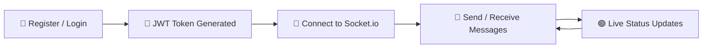

<div align="center">


<br/>


<br/>

<a href="https://chatting-frontend-wine.vercel.app/">
  
</a>
<a href="https://github.com/ayushi48/Chatting">
  
</a>

<br/>


</div>

<br/>

## 📌 Overview

> A full-stack real-time messaging application designed for smooth, secure, and instant communication between users.

**Chatting** brings people together with secure authentication, real-time message delivery, live online/offline presence tracking, and a clean, responsive interface — all powered by **Socket.io**.

Built with performance and scalability at its core, it delivers a fast, seamless experience across every device.

<br/>

## 🔗 Quick Links

<div align="center">

| 🌐 Live Demo | 📦 Repository | 👤 Portfolio |
|:---:|:---:|:---:|
| [Visit App →](https://chatting-frontend-wine.vercel.app/) | [View Code →](https://github.com/ayushi48/Chatting) | [See Work →](https://ayushikumari.me/) |

</div>

<br/>

## ✨ Features

<table>
<tr>
<td width="50%" valign="top" align="center>

### 💬 Real-Time Messaging
- Instant message delivery
- Live updates, zero refresh
- Powered by Socket.io
- Smooth, responsive chat UI

</td>
<td width="50%" valign="top">

### 🔐 Authentication & Security
- JWT-based authentication
- Secure login & registration
- Protected routes & APIs
- Safe session handling

</td>
</tr>
<tr>
<td width="50%" valign="top">

### 🟢 User Presence
- Online / offline status
- Active user tracking
- Real-time updates

</td>
<td width="50%" valign="top">

### 🎨 Modern UI/UX
- Clean, minimal interface
- Fully responsive design
- Fast & optimized frontend

</td>
</tr>
</table>

<br/>

## ⚙️ Tech Stack

<div align="center">


</div>

<br/>

<div align="center">

| Layer | Technology |
|:--|:--|
| 🎨 **Frontend** | React.js · Tailwind CSS |
| ⚙️ **Backend** | Node.js · Express.js |
| 🗄️ **Database** | MongoDB |
| ⚡ **Real-Time** | Socket.io |
| 🔑 **Auth** | JWT (JSON Web Token) |
| 🌐 **HTTP Client** | Axios |

</div>

<br/>

## 📂 Project Structure

```
Chatting/
├── frontend/       # React + Tailwind client
├── backend/        # Node.js + Express server
├── package.json
└── README.md
```

<br/>

## 🔄 How It Works



<br/>

## 🚀 Getting Started

### 1️⃣ Clone the repository
```bash
git clone https://github.com/shubham-kumar145/Chatting.git
cd Chatting
```

### 2️⃣ Install dependencies

<details>
<summary><b>Frontend</b></summary>

```bash
cd frontend
npm install
```
</details>

<details>
<summary><b>Backend</b></summary>

```bash
cd backend
npm install
```
</details>

### 3️⃣ Configure environment variables

Create a `.env` file inside `backend/`:

```env
PORT=5000
MONGO_URI=your_mongodb_connection
JWT_SECRET=your_secret_key
```

### 4️⃣ Run the app

<details>
<summary><b>Start Backend</b></summary>

```bash
cd backend
npm run dev
```
</details>

<details>
<summary><b>Start Frontend</b></summary>

```bash
cd frontend
npm run dev
```
</details>

<br/>

## 🔮 Roadmap

- [ ] 👥 Group chat support
- [ ] 📞 Voice & video calling
- [ ] 📎 File & media sharing
- [ ] 😀 Emoji reactions
- [ ] 🔔 Push notifications
- [ ] 🌙 Dark mode
- [ ] 📱 Progressive Web App (PWA)

<br/>

## 👨‍💻 Author

<div align="center">


*Full-Stack Developer • Competitive Programmer • Open Source Contributor*

<br/>

<a href="https://github.com/ayushi48/Chatting">
  
</a>
<a href="https://www.linkedin.com/in/ayushi-kumari48/">
  
</a>
<a href="https://ayushikumari.me/">
  
</a>

</div>

<br/>

## ⭐ Support

If this project helped or inspired you, consider giving it a **star** — it means a lot! ⭐

<div align="center">


</div>
