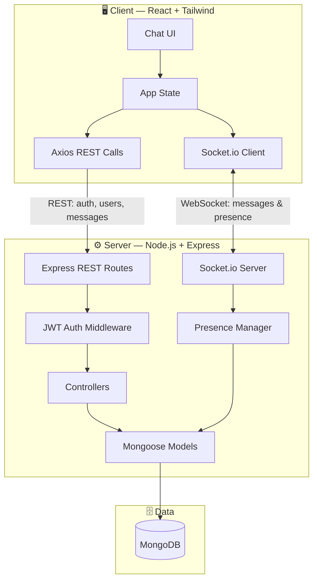
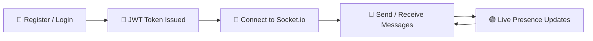

<div align="center">


<br/>


<br/>

<a href="https://chatting-frontend-wine.vercel.app/">
  
</a>
<a href="https://github.com/ayushi48/Chatting">
  
</a>
<a href="https://ayushikumari.me/">
  
</a>

<br/><br/>


</div>

<br/>

## 📌 Overview

> A full-stack real-time messaging application designed for smooth, secure, and instant communication between users.

**Chatting** brings people together with secure authentication, real-time message delivery, live online/offline presence tracking, and a clean, responsive interface — all powered by **Socket.io**.

Built with performance and scalability at its core, it delivers a fast, seamless experience across every device.

<br/>

## 🧭 Table of Contents

- [🔗 Quick Links](#-quick-links)
- [✨ Features](#-features)
- [🛠️ Tech Stack](#️-tech-stack)
- [🏗️ System Architecture](#️-system-architecture)
- [🗂️ Project Structure](#️-project-structure)
- [🚀 Getting Started](#-getting-started)
- [🔮 Roadmap](#-roadmap)
- [👩‍💻 Author](#-author)

<br/>

## 🔗 Quick Links

<div align="center">

| 🌐 Live Demo | 📦 Repository | 👤 Portfolio |
|:---:|:---:|:---:|
| [Visit App →](https://chatting-frontend-wine.vercel.app/) | [View Code →](https://github.com/ayushi48/Chatting) | [See Work →](https://ayushikumari.me/) |

</div>

<br/>

## ✨ Features

<table>
<tr>
<td width="50%" valign="top">

### 💬 Real-Time Messaging
- Instant message delivery
- Live updates, zero refresh
- Powered by Socket.io
- Smooth, responsive chat UI

</td>
<td width="50%" valign="top">

### 🔐 Authentication & Security
- JWT-based authentication
- Secure login & registration
- Protected routes & APIs
- Safe session handling

</td>
</tr>
<tr>
<td width="50%" valign="top">

### 🟢 User Presence
- Online / offline status
- Active user tracking
- Real-time updates

</td>
<td width="50%" valign="top">

### 🎨 Modern UI/UX
- Clean, minimal interface
- Fully responsive design
- Fast & optimized frontend

</td>
</tr>
</table>

<br/>

## 🛠️ Tech Stack

<div align="center">


</div>

<br/>

<div align="center">

| Layer | Technology |
|:--|:--|
| 🎨 **Frontend** | React.js · Vite · Tailwind CSS |
| ⚙️ **Backend** | Node.js · Express.js |
| 🗄️ **Database** | MongoDB |
| ⚡ **Real-Time** | Socket.io |
| 🔑 **Auth** | JWT (JSON Web Token) |
| 🌐 **HTTP Client** | Axios |
| ☁️ **Deployment** | Vercel |

</div>

<br/>

## 🏗️ System Architecture

The REST API handles auth, users, and message history; Socket.io runs alongside it as a persistent connection layer for live delivery and presence — so a page refresh never loses state, but nothing waits on a request/response round trip either.


```mermaid
graph TB
    subgraph CLIENT["🖥️ Client — React + Tailwind"]
        UI[Chat UI] --> STATE[App State]
        STATE --> AXIOS[Axios REST Calls]
        STATE --> SOCKC[Socket.io Client]
    end

    subgraph SERVER["⚙️ Server — Node.js + Express"]
        ROUTES[Express REST Routes] --> AUTHMW[JWT Auth Middleware]
        AUTHMW --> CTRL[Controllers]
        SOCKS[Socket.io Server] --> PRESENCE[Presence Manager]
        CTRL --> MODELS[Mongoose Models]
        PRESENCE --> MODELS
    end

    subgraph DATA["🗄️ Data"]
        DB[(MongoDB)]
    end

    AXIOS -->|REST: auth, users, messages| ROUTES
    SOCKC <-->|WebSocket: messages & presence| SOCKS
    MODELS --> DB
```

**Message & Presence Flow**


```mermaid
graph LR
    A[🔐 Register / Login] --> B[🎫 JWT Token Issued]
    B --> C[🔌 Connect to Socket.io]
    C --> D[💬 Send / Receive Messages]
    D --> E[🟢 Live Presence Updates]
    E --> D
```

<br/>

## 🗂️ Project Structure

```
Chatting/
├── Chatting App Backend/
│   └── src/
│       ├── controllers/       # Route handler logic
│       ├── lib/                # Shared utilities (e.g. Socket.io setup)
│       ├── middleware/         # JWT auth & request middleware
│       ├── models/             # Mongoose schemas
│       ├── routes/             # API route definitions
│       ├── seeds/              # Database seed scripts
│       └── index.js            # Entry point
│
├── Chatting App Frontend/
│   ├── public/
│   ├── src/
│   ├── index.html
│   ├── eslint.config.js
│   ├── tailwind.config.js
│   ├── postcss.config.js
│   ├── vercel.json
│   ├── vite.config.js
│   └── package.json
│
├── LICENSE
└── README.md
```

<br/>

## 🚀 Getting Started

### 1️⃣ Clone the repository
```bash
git clone https://github.com/ayushi48/Chatting.git
cd Chatting
```

### 2️⃣ Install dependencies

<details>
<summary><b>Backend</b></summary>

```bash
cd "Chatting App Backend"
npm install
```
</details>

<details>
<summary><b>Frontend</b></summary>

```bash
cd "Chatting App Frontend"
npm install
```
</details>

### 3️⃣ Configure environment variables

Create a `.env` file inside `Chatting App Backend/`:

```env
PORT=5000
MONGO_URI=your_mongodb_connection
JWT_SECRET=your_secret_key
```

### 4️⃣ Run the app

<details>
<summary><b>Start Backend</b></summary>

```bash
cd "Chatting App Backend"
npm run dev
```
</details>

<details>
<summary><b>Start Frontend</b></summary>

```bash
cd "Chatting App Frontend"
npm run dev
```
</details>

<br/>

## 🔮 Roadmap

- [ ] 👥 Group chat support
- [ ] 📞 Voice & video calling
- [ ] 📎 File & media sharing
- [ ] 😀 Emoji reactions
- [ ] 🔔 Push notifications
- [ ] 🌙 Dark mode
- [ ] 📱 Progressive Web App (PWA)

<br/>

## 👩‍💻 Author

**Ayushi Kumari**

---

**Full-Stack Developer • Competitive Programmer • Open Source Contributor**

- 🌐 Portfolio: [ayushikumari.me](https://ayushikumari.me/)
- 💻 GitHub: [github.com/ayushi48](https://github.com/ayushi48)
- 💼 LinkedIn: [linkedin.com/in/ayushi-kumari48](https://www.linkedin.com/in/ayushi-kumari48/)
- ✉️ Email: [ayushikr2016@gmail.com](mailto:ayushikr2016@gmail.com)

<br/>

## ⭐ Support

If this project helped or inspired you, consider giving it a **star** — it means a lot! ⭐

<div align="center">


</div>
